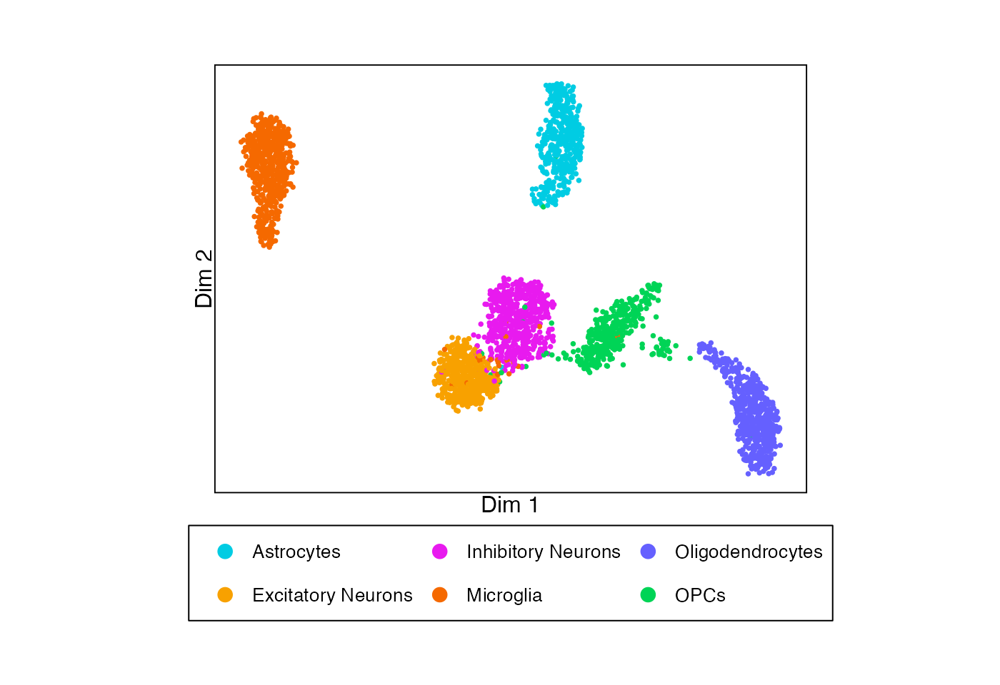
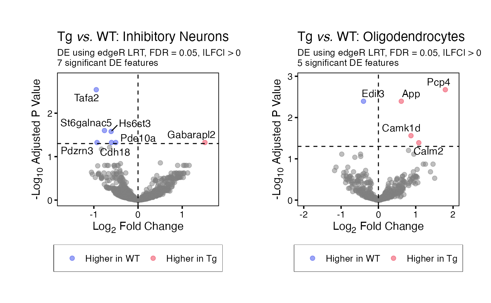
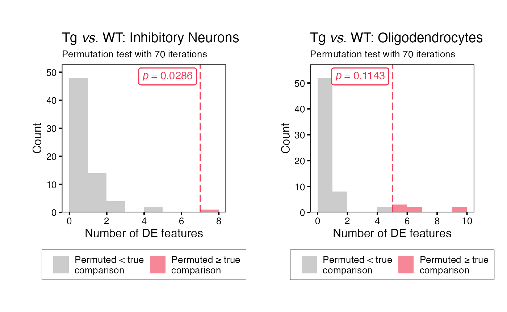
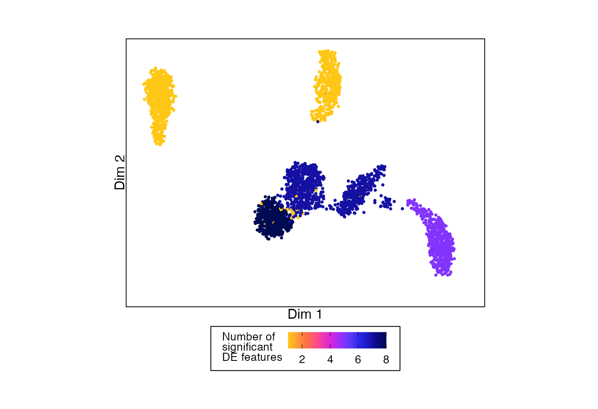
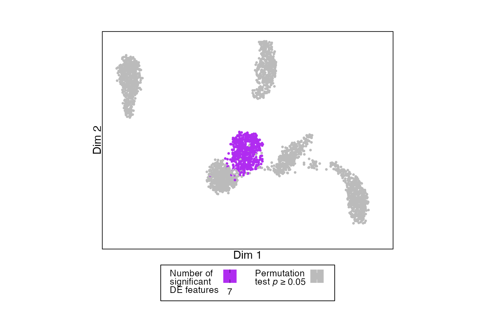
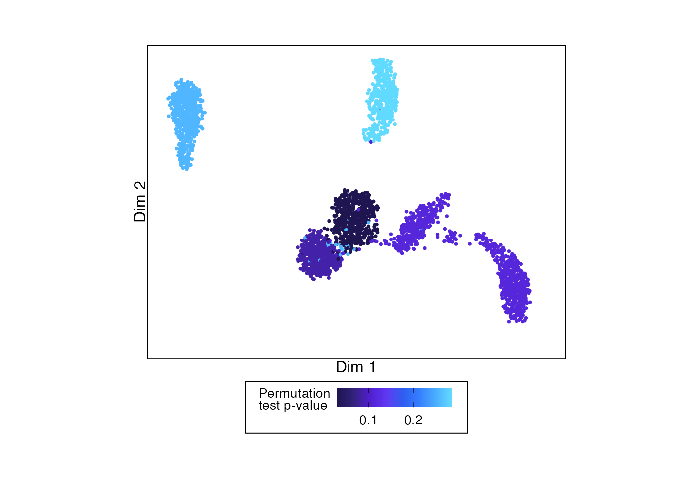
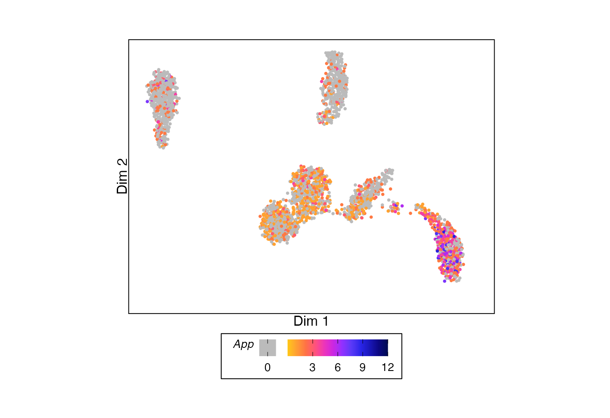
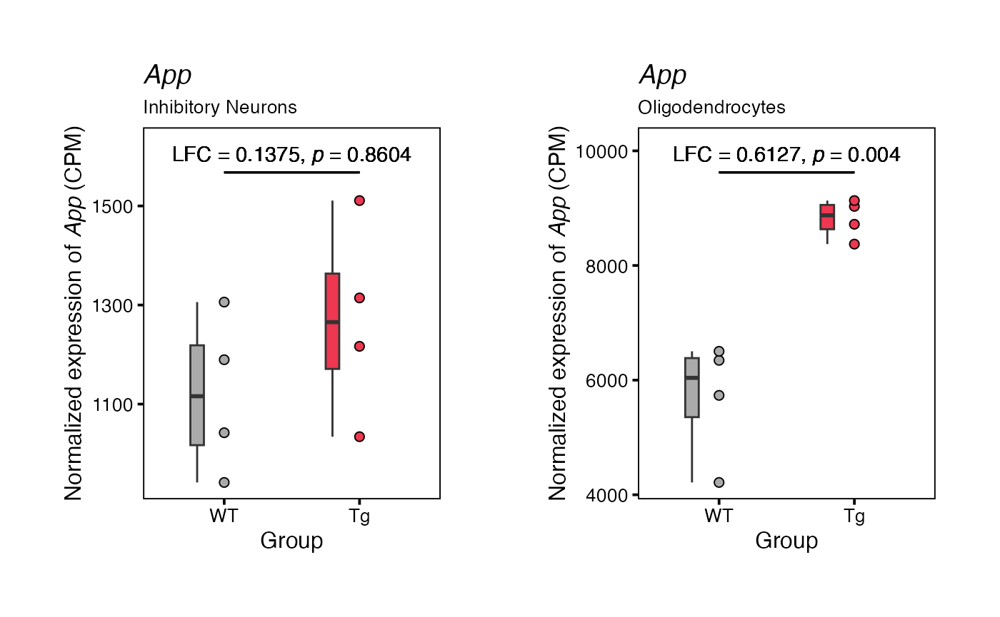
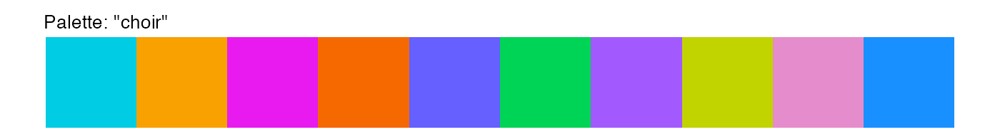
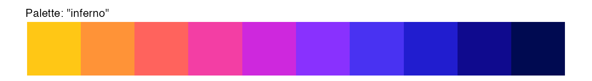

# permuteDE

## Installation

------------------------------------------------------------------------

permuteDE is designed to be run on Unix-based operating systems such as
macOS and linux.

permuteDE installation currently requires `remotes` and `BiocManager`
for installation of GitHub and Bioconductor packages. Run the following
commands to install the various dependencies used by permuteDE:

First, install remotes (for installing GitHub packages) if it isn’t
already installed:

``` r
if (!requireNamespace("remotes", quietly = TRUE)) install.packages("remotes")
```

Then, install BiocManager (for installing bioconductor packages) if it
isn’t already installed:

``` r
if (!requireNamespace("BiocManager", quietly = TRUE)) install.packages("BiocManager")
```

Then, install permuteDE:

``` r
remotes::install_github("corceslab/permuteDE", ref="main", repos = BiocManager::repositories(), upgrade = "never")
```

------------------------------------------------------------------------

## Introduction

------------------------------------------------------------------------

This tutorial provides a basic example of how to run permuteDE, an R
package intended to help users assess which differential expression
comparisons can be trusted and which should be met with skepticism.

permuteDE is applicable to any sequencing data suitable for differential
expression analysis. It takes as input a Seurat object,
SingleCellExperiment object, or matrix (see [Advanced
Options](https://www.permuteDE.com/articles/permuteDE.html#input-object-types)
for details about input object types). Detailed parameter definitions
are available under the
[Functions](https://www.permuteDE.com/reference/index.html) tab.

Differential expression analyses are susceptible to false positives, and
it can be difficult to prioritize the most robust results for further
study. permuteDE is based on the premise that the differential
expression results that are most likely to be validated in subsequent
experiments come from comparisons that have a higher number of
significant differentially expressed features than would be expected by
chance. The use of permutation testing allows permuteDE to generate a
distribution estimating how many false positive significant
differentially expressed features occur by chance alone.

permuteDE proceeds in two main steps. First, the user will use function
[`runDE()`](../reference/runDE.md) to run differential expression
analysis using one of the several available methods. Second, these
results are then passed to the
[`permuteDE()`](../reference/permuteDE.md) function, which performs the
permutation test.

You’ll need the following packages installed to run this tutorial:

``` r
library(Seurat)
library(permuteDE)
```

#### Input data

permuteDE takes as input a Seurat, SingleCellExperiment, or matrix. If a
matrix is provided, it may be either a cell-level matrix or a
pre-generated pseudobulk matrix. This tutorial uses a Seurat object; for
details related to other object types, see [Advanced
Options](https://www.permuteDE.com/articles/permuteDE.html#input-object-types).
permuteDE expects raw counts, and normalization is performed during the
differential expression analysis depending on the selected method.

To demonstrate how to run permuteDE, we’ll use a small sample dataset
consisting of mouse brain snRNA-seq data, stored as a Seurat object.

``` r
# Load dataset from permuteDE package
data("sample_data")

# Seurat object containing a count matrix, UMAP coordinates, and cell metadata
plotDimReduction(reduction = sample_data@reductions$umap@cell.embeddings,
                 split_labels = sample_data$cell_type,
                 color_by = "split")
```



------------------------------------------------------------------------

## Running permuteDE

------------------------------------------------------------------------

permuteDE proceeds in two main steps, each corresponding to a function:
(1) [`runDE()`](../reference/runDE.md) and (2)
[`permuteDE()`](../reference/permuteDE.md).

### Step 1: `runDE()`

Function [`runDE()`](../reference/runDE.md) will run differential
expression analysis to compare two groups.

By default, [`runDE()`](../reference/runDE.md) will generate pseudobulk
matrices using the metadata provided to parameters `replicate_labels`
(representing each biological replicate) and, optionally, `split_labels`
(representing a further division of the data, often cell types). The
pseudobulk matrices will be returned as part of the output of
[`runDE()`](../reference/runDE.md), but they can also be extracted
separately using function
[`getPseudobulk()`](../reference/getPseudobulk.md).

Alternately, users may opt to run cell-level tests instead of pseudobulk
tests (set parameter `pseudobulk` to “none”) or to provide pre-generated
pseudobulk matrices (set parameter `pseudobulk` to “supplied”). See
[Advanced
Options](https://www.permuteDE.com/articles/permuteDE.html#matrix-input)
for more details.

Function [`runDE()`](../reference/runDE.md) allows the user to run
several different methods of differential expression analysis, by
adjusting parameters `de_method` and `de_test`:

- `edgeR`: “LRT”, “QLF”, “exact”
- `DESeq2`: “LRT”, “Wald”
- `limma`: “trend”, “voom”, “wilcox_cpm”, “wilcox_cpm_log”
- `presto`: “wilcox_cpm”, “wilcox_cpm_log”
- `BPCells`: “wilcox_cpm”, “wilcox_cpm_log”

By default, [`runDE()`](../reference/runDE.md) will run differential
expression analysis using `edgeR` LRT. The precise execution of the
differential expression analysis can be further adjusted using parameter
`de_params` to pass further parameters to the selected method. This
function is parallelized when multiple splits are assessed, so
efficiency improves as `n_cores` is increased, up to the number of
splits.

``` r
runDE_output <- runDE(object = sample_data,
                      replicate_labels = "sample",
                      group_labels = "group",
                      split_labels = "cell_type",
                      reference_group = "WT",
                      n_cores = 2)
#> 2026-06-24 23:09:21 : Generating 6 pseudobulk matrices..
#> 2026-06-24 23:09:21 : Fetching feature x cell matrix using 'RNA' assay and 'counts' layer..
#> Excluded between 19.43% (340 features) and 69.6% (1218 features) of features in each split.
#> Highest % of features excluded in split 'Microglia'.
#> Excluded between 1.89% (6632 reads) and 21.72% (49437 reads) of reads in each split.
#> Highest % of reads excluded in split 'Microglia'.
#> 2026-06-24 23:09:22 : Running DE on 6 matrices..
```

The output is a list containing the following elements:

- `DE_results` Dataframe containing DE results for each feature, by
  split
- `PB_values` If using pseudobulk data, a list of feature x replicate
  matri(ces) containing pseudobulk values for each feature, one matrix
  per split
- `cell_values` Alternately, if using cell-level data, a list of feature
  x cell matri(ces) containing counts for each feature, one matrix per
  split
- `metadata` List recording characteristics of the data and runtime
- `parameters` List recording parameter values used

``` r
head(runDE_output$DE_results)
#>   feature        lfc       pvalue       padj      split
#> 1   Stmn1  2.1530904 7.127649e-05 0.04077015 Astrocytes
#> 2    Pan3 -1.5612588 2.635217e-04 0.07536720 Astrocytes
#> 3  Slc4a4 -0.6058453 9.404665e-04 0.17931562 Astrocytes
#> 4   Pcsk2  1.7141881 1.798391e-03 0.25716996 Astrocytes
#> 5    Rpl3  1.4697542 2.957641e-03 0.32330591 Astrocytes
#> 6    Fat3 -0.8415779 3.565231e-03 0.32330591 Astrocytes
```

### Step 2: `permuteDE()`

Function [`permuteDE()`](../reference/permuteDE.md) will take the output
from function [`runDE()`](../reference/runDE.md), permute the group
labels and rerun differential expression analysis in the same way across
a number of iterations set by parameter `n_iterations`. The parameters
are inherited from the [`runDE()`](../reference/runDE.md) function call.
For each iteration, the number of significant differentially expressed
features is counted, forming a distribution to which the “true” number
of significantly differentially expressed features is compared using a
permutation test. This permutation test yields a p-value that suggests
the probability of observing a number of significant features greater
than or equal to the one output by the
[`runDE()`](../reference/runDE.md) function if the two groups are not
truly different.

The default number of iterations (set by parameter `n_iterations`) is
1000. However, for smaller datasets such as this one where the number of
possible combinations of group labels is less than 1000, the permutation
test is run using all possible combinations with no repeats. This
function is highly parallelized, so efficiency greatly improves as
`n_cores` is increased.

``` r
permuteDE_output <- permuteDE(input = runDE_output,
                              n_cores = 2)
#> 2026-06-24 23:09:22 : Differential expression results for group WT vs. Tg across 6 pseudobulk matrices..
#> 2026-06-24 23:09:22 : Input 1000 for parameter 'n_combinations' exceeds the number of possible combinations 70. Only 70 combinations will be generated for split Astrocytes (1/6).
#> 2026-06-24 23:09:22 : Generating 70 of 70 possible combinations for split Astrocytes (1/6)..
#> 2026-06-24 23:09:22 : Running 70 permutations for split Astrocytes (1/6)..
#> 2026-06-24 23:09:26 : Input 1000 for parameter 'n_combinations' exceeds the number of possible combinations 70. Only 70 combinations will be generated for split Excitatory Neurons (2/6).
#> 2026-06-24 23:09:26 : Generating 70 of 70 possible combinations for split Excitatory Neurons (2/6)..
#> 2026-06-24 23:09:26 : Running 70 permutations for split Excitatory Neurons (2/6)..
#> 2026-06-24 23:09:32 : Input 1000 for parameter 'n_combinations' exceeds the number of possible combinations 70. Only 70 combinations will be generated for split Inhibitory Neurons (3/6).
#> 2026-06-24 23:09:32 : Generating 70 of 70 possible combinations for split Inhibitory Neurons (3/6)..
#> 2026-06-24 23:09:32 : Running 70 permutations for split Inhibitory Neurons (3/6)..
#> 2026-06-24 23:09:38 : Input 1000 for parameter 'n_combinations' exceeds the number of possible combinations 70. Only 70 combinations will be generated for split Microglia (4/6).
#> 2026-06-24 23:09:38 : Generating 70 of 70 possible combinations for split Microglia (4/6)..
#> 2026-06-24 23:09:38 : Running 70 permutations for split Microglia (4/6)..
#> 2026-06-24 23:09:41 : Input 1000 for parameter 'n_combinations' exceeds the number of possible combinations 70. Only 70 combinations will be generated for split Oligodendrocytes (5/6).
#> 2026-06-24 23:09:41 : Generating 70 of 70 possible combinations for split Oligodendrocytes (5/6)..
#> 2026-06-24 23:09:41 : Running 70 permutations for split Oligodendrocytes (5/6)..
#> 2026-06-24 23:09:44 : Input 1000 for parameter 'n_combinations' exceeds the number of possible combinations 70. Only 70 combinations will be generated for split OPCs (6/6).
#> 2026-06-24 23:09:44 : Generating 70 of 70 possible combinations for split OPCs (6/6)..
#> 2026-06-24 23:09:44 : Running 70 permutations for split OPCs (6/6)..
```

The output is a list containing the following elements:

- `permutation_test_results` Dataframe containing the permutation test
  results by split
- `permutation_DE_summary` Dataframe containing the permutation DE
  summary metrics by split
- `permutation_DE_results` If parameter `return_all` is `TRUE`,
  dataframe DE results for each feature, by split, for each iteration
  (note that this substantially increases the size of the output)
- `metadata` List recording characteristics of the data and runtime
- `parameters` List recording parameter values used

``` r
head(permuteDE_output$permutation_test_results)
#>                split runDE_n_sig     pvalue n_iterations
#> 1         Astrocytes           1 0.28571429           70
#> 2 Excitatory Neurons           8 0.08571429           70
#> 3 Inhibitory Neurons           7 0.02857143           70
#> 4          Microglia           1 0.25714286           70
#> 5   Oligodendrocytes           5 0.11428571           70
#> 6               OPCs           7 0.11428571           70
```

``` r
head(permuteDE_output$permutation_DE_summary)
#>        split permutation reference_group_overlap non_reference_group_overlap
#> 1 Astrocytes           1                    0.50                        0.50
#> 2 Astrocytes           2                    0.25                        0.25
#> 3 Astrocytes           3                    0.50                        0.50
#> 4 Astrocytes           4                    0.75                        0.75
#> 5 Astrocytes           5                    0.50                        0.50
#> 6 Astrocytes           6                    0.25                        0.25
#>   n_sig min_lfc_sig max_lfc_sig min_lfc_all max_lfc_all
#> 1     1  -0.7063576  -0.7063576   -1.306694    2.303966
#> 2     0          NA          NA   -1.918125    1.173536
#> 3     0          NA          NA   -1.128684    1.283791
#> 4     4  -1.5885933   2.7290607   -1.588593    2.729061
#> 5     0          NA          NA   -2.501939    1.356584
#> 6     0          NA          NA   -1.374724    1.068373
```

### Plot

permuteDE has several built-in plotting functions to help display the
results from functions [`runDE()`](../reference/runDE.md) and
[`permuteDE()`](../reference/permuteDE.md). All plots are modifiable
`ggplot` outputs.

To generate volcano plots for each split assessed by
[`runDE()`](../reference/runDE.md) use function
[`plotVolcano()`](../reference/plotVolcano.md). To generate a volcano
plot for a specific split or subset of splits, set parameter
`use_splits` to the relevant split name(s).

``` r
# Generate a list of volcano plots
volcano_plots <- plotVolcano(input = runDE_output)
# Display examples
volcano_plots[["Inhibitory Neurons"]] | volcano_plots[["Oligodendrocytes"]]
```



To generate histograms for each permutation test (or a single split),
use function [`plotHistogram()`](../reference/plotHistogram.md). These
histograms display the distribution of the number of significant
differentially expressed features in each iteration of the permutation
test, and a dashed line where the “true” results fall on this
distribution.To generate a histogram for a specific split or subset of
splits, set parameter `use_splits` to the relevant split name(s).

``` r
# Generate a list of histograms
histogram_plots <- plotHistogram(input = permuteDE_output)
# Display examples
histogram_plots[["Inhibitory Neurons"]] | histogram_plots[["Oligodendrocytes"]]
```



One way to summarise the results from permuteDE is to color a UMAP by
the number of differentially expressed features in each split (in this
case, cell type).

``` r
# Example UMAP showing number of DE features for each split
plotDimReduction(reduction = sample_data@reductions$umap@cell.embeddings,
                 input = permuteDE_output,
                 split_labels = sample_data$cell_type,
                 color_by = "n_sig")
```



In this plot, cell types are grayed out if the permutation test p-value
was \> 0.05.

``` r
# Example UMAP showing number of DE features for each split that passes permutation testing threshold
plotDimReduction(reduction = sample_data@reductions$umap@cell.embeddings,
                 input = permuteDE_output,
                 split_labels = sample_data$cell_type,
                 color_by = "n_sig",
                 permutation_test_alpha = 0.05)
```



Or we can color by the p-values from the permutation test.

``` r
# Example UMAP showing permutation testing p-value for each split
plotDimReduction(reduction = sample_data@reductions$umap@cell.embeddings,
                 input = permuteDE_output,
                 split_labels = sample_data$cell_type,
                 color_by = "pvalue",
                 palette = "frozen")
```



This function can also be used analogously to
[`Seurat::FeaturePlot()`](https://satijalab.org/seurat/reference/FeaturePlot.html)
to show the values for a single feature across the cells.

``` r
# Example UMAP showing permutation testing p-value for each split
plotDimReduction(reduction = sample_data@reductions$umap@cell.embeddings,
                 feature_values = sample_data@assays$RNA$counts["App",],
                 feature_name = "*App*",
                 color_by = "feature")
```



To plot the results for a single feature, use function
[`plotFeature()`](../reference/plotFeature.md). By default, this
function will apply CPM normalization (using
[`edgeR::cpm()`](https://rdrr.io/pkg/edgeR/man/cpm.html)), but this can
be changed using the parameter `normalization_method`.

``` r
# Generate a list of plots
feature_plots <- plotFeature(input = runDE_output,
                             feature = "App",
                             use_splits = c("Inhibitory Neurons", "Oligodendrocytes"))
# Display examples
feature_plots[["Inhibitory Neurons"]] | feature_plots[["Oligodendrocytes"]]
```



------------------------------------------------------------------------

## Advanced Options

------------------------------------------------------------------------

### Input object types

Function [`runDE()`](../reference/runDE.md) accepts three input object
types: Seurat objects, SingleCellExperiment objects, and matrices.

#### Seurat

For Seurat objects, the “RNA” assay is used if no input is provided for
parameter `use_assay`. If no input is provided for parameter `use_slot`,
the “counts” default slot (Seurat v4) or layer (Seurat v5) is used.

Some Seurat v5 objects have multiple layers (e.g., “counts.1”,
“counts.2”, “counts.2”..) with different subsets of cells stored under
the same assay. Currently, permuteDE requires a single layer containing
all cells in an assay. For these cases, please re-organize the Seurat
object prior to running permuteDE.

For Seurat objects, the input to parameters `replicate_labels`,
`group_labels`, and `split_labels` may be either a string indicating the
name of the metadata column containing the labels or a character vector
containing the labels in the same order as the cells.

#### SingleCellExperiment

For SingleCellExperiment objects, only the `use_assay` parameter is
needed. If not provided, it is set to “counts”. Please ensure that the
relevant assay matrix includes both row and column names.

For SingleCellExperiment objects, the input to parameters
`replicate_labels`, `group_labels`, and `split_labels` may be either a
string indicating the name of the metadata column containing the labels
or a character vector containing the labels in the same order as the
cells.

#### Matrix input

For matrix inputs, the provided matrix may be either a cell-level matrix
(feature x cell) or a pre-generated pseudobulk matrix (feature x
replicate). All permuteDE functions expect raw counts.

If a pre-generated pseudobulk matrix is provided, parameter `pseudobulk`
must be set to “supplied”.

For matrix inputs, the required input to parameters `replicate_labels`,
`group_labels`, and `split_labels` must be provided either:

- As a `data.frame` to parameter `metadata` with column names designated
  by `replicate_labels`, `group_labels`, and `split_labels`

- Directly to `replicate_labels`, `group_labels`, and `split_labels` as
  vectors containing the labels in order, corresponding to each column
  of the matrix

Here’s an example of how to apply function
[`runDE()`](../reference/runDE.md) to a feature x cell matrix:

``` r
# Extract count matrix from the sample dataset
counts_matrix <- sample_data@assays$RNA$counts
# Extract relevant metadata as a vector
replicates <- sample_data$sample
groups <- sample_data$group
splits <- sample_data$cell_type

# Run 
runDE_output <- runDE(object = counts_matrix,
                      replicate_labels = replicates,
                      group_labels = groups,
                      split_labels = splits,
                      reference_group = "WT",
                      n_cores = 2)
```

Or a pre-generated pseudobulk matrix:

``` r
# Pre-generate pseudobulk matrix
pb_matrix_list <- getPseudobulk(object = sample_data,
                                replicate_labels = "sample",
                                split_labels = "cell_type",
                                n_cores = 2)
pb_matrix <- pb_matrix_list$PB_values[["Oligodendrocytes"]]

# Extract relevant metadata as a vector
replicates <- colnames(pb_matrix)
groups <- sample_data$group[match(replicates, paste0("rep_", sample_data$sample))]

# Run 
runDE_output <- runDE(object = pb_matrix,
                      replicate_labels = replicates,
                      group_labels = groups,
                      reference_group = "WT",
                      pseudobulk = "supplied",
                      n_cores = 2)
```

------------------------------------------------------------------------

### Complex designs

#### Incorporating covariates or multiple factors

To run differential expression analysis accounting for multiple
factors/covariates, set parameter `design` in function
[`runDE()`](../reference/runDE.md) to a character string providing the
desired model formula.

*Important notes:*

- Complex model formulas are not compatible with the Wilcoxon rank sum
  test

- By default, only results for the group comparison are returned; to see
  results for covariates set parameter `de_params` to
  `list(return_all_coefficients = TRUE)` and parameter `return_raw_de`
  to `TRUE`

Here is an example comparing the groups within the sample data while
additionally correcting for batch effects.

``` r
runDE_output <- runDE(object = sample_data,
                      replicate_labels = "sample",
                      group_labels = "group",
                      split_labels = "cell_type",
                      reference_group = "WT",
                      design = "~ batch + group",
                      n_cores = 2)
```

In most cases, no additional parameter adjustments are needed to run the
permutation test with the specified model formula.

``` r
permuteDE_output <- permuteDE(input = runDE_output,
                              n_cores = 2)
```

#### Comparisons within the same replicates (e.g., cell type comparisons)

The default usage of [`runDE()`](../reference/runDE.md) does not permit
duplicate replicate labels across different comparison groups.
Therefore, to compare cell populations wherein the set of replicates is
shared across the two groups of interest (e.g., two different cell types
or states from the same set of samples), set the parameter
`replicate_labels` in function [`runDE()`](../reference/runDE.md) to a
concatenation of the replicate labels and the group labels.

``` r
# Add concatenated metadata column
sample_data$sample_cell_type <- paste(sample_data$sample, sample_data$cell_type, sep = "_")
```

Then, you can run either an unpaired or paired test:

##### Option 1: Unpaired

Here is an example comparing the gene expression between excitatory
vs. inhibitory neurons in the sample dataset:

``` r
runDE_output <- runDE(object = sample_data,
                      replicate_labels = "sample_cell_type",
                      group_labels = "cell_type",
                      use_cells = colnames(sample_data)[sample_data$cell_type %in% c("Excitatory Neurons", "Inhibitory Neurons")],
                      reference_group = "Excitatory Neurons",
                      n_cores = 2)

permuteDE_output <- permuteDE(input = runDE_output,
                              n_cores = 2)
```

##### Option 2: Paired

To run a paired comparison, set parameter `design` in function
[`runDE()`](../reference/runDE.md) to an additive model formula without
an interaction term.

For example, to compare the gene expression between excitatory
vs. inhibitory neurons in the sample dataset, our model formula would be
`~ sample + cell_type`.

``` r
runDE_output <- runDE(object = sample_data,
                      replicate_labels = "sample_cell_type",
                      group_labels = "cell_type",
                      use_cells = colnames(sample_data)[sample_data$cell_type %in% c("Excitatory Neurons", "Inhibitory Neurons")],
                      reference_group = "Excitatory Neurons",
                      design = "~ sample + cell_type",
                      n_cores = 2)
```

When running function [`permuteDE()`](../reference/permuteDE.md) on
paired comparisons, it is important to provide the correct input to
parameter `permute_within`, such that group labels are shuffled
separately within each paired set. In this example, `permute_within`
should be set to `"sample"`.

``` r
permuteDE_output <- permuteDE(input = runDE_output,
                              permute_within = "sample",
                              n_cores = 2)
```

------------------------------------------------------------------------

### permuteDE parameters

#### Significance level & multiple comparison correction

The default significance level used by permuteDE is `alpha = 0.05` with
multiple comparison correction using FDR = 0.05. The method of multiple
comparison correction can be changed using parameter `p_adjust_method`
(for permitted values, see
[`stats::p.adjust.methods`](https://rdrr.io/r/stats/p.adjust.html)). By
default, permuteDE also requires that significant differentially
expressed features have a \|LFC\| \> 0.5 (parameter `lfc_threshold`).

Parameter `p_adjust_method` can also accept the value `"fdrtool"`, for
advanced users who wish to apply `fdrtool` p-value adjustment. By
default, `fdrtool` will be applied to raw p-values. For DE method
`DESeq2` using the `"Wald"` test, users can apply `fdrtool` to z-scores
by setting parameter `de_params` to
`list(fdrtool = list(statistic = "zscore"))`.

#### Filters

permuteDE uses various filters to reduce the number of DE comparisons:

- Parameter `min_cells_per_split` indicates the minimum number of cells
  within one split. Defaults to 100.
- Parameter `min_cells_per_replicate` indicates the minimum number of
  cells within one replicate for each split. Defaults to 10.
- Parameter `min_replicates_per_split` indicates minimum number of
  distinct replicates represented within one split. Defaults to 6.
- Parameter `min_replicates_per_group` indicates the minimum number of
  distinct replicates represented within each of the two comparison
  groups. Defaults to 3.
- Parameter `min_cells_per_feature` indicates the minimum number of
  cells (within a split) with expression of a feature. Defaults to 10.
- Parameter `min_prop_cells_per_feature` indicates the minimum
  proportion of cells (within a split) with expression of a feature.
  Defaults to 0.1.

#### Pseudobulk vs. cell-level tests

We highly encourage users to use pseudobulk differential expression
analysis, as it reduces the incidence of false positives. However,
permuteDE is also compatible with cell-level tests. To run function
[`runDE()`](../reference/runDE.md) without pseudobulking, and treating
the cells as the statistical sample size, set parameter `pseudobulk` to
“none”. This works with any input object type, including cell x feature
matrices. Please note that the size of the returned output will be
substantially larger, since the cell x feature matrices will be returned
as output so that they can be subsequently passed to function
[`permuteDE()`](../reference/permuteDE.md).

``` r
runDE_output <- runDE(object = sample_data,
                      group_labels = "group",
                      split_labels = "cell_type",
                      reference_group = "WT",
                      pseudobulk = "none",
                      n_cores = 2)
```

When running cell-level tests, we still recommend that users provide the
biological replicate labels to function
[`permuteDE()`](../reference/permuteDE.md) using parameter `permute_by`,
such that when the group labels are permuted, cells from each biological
replicate are not separated. In other words, the permutation occurs at
the biological replicate level, even for cell-level tests. Input to
`permute_by` must either be a column name already present in the output
under the dataframe `$metadata$group_key` from function
[`runDE()`](../reference/runDE.md), or a vector with values
corresponding to each row of that dataframe.

If input is not provided to parameter `permute_by`, the group labels
will be permuted across cells regardless of the biological replicate.

``` r
# Grab sample labels for each row of group key
sample_labels <- sample_data@meta.data[runDE_output$metadata$group_key$replicate, "sample"]
# Provide to parameter 'permute_by'
permuteDE_output <- permuteDE(input = runDE_output,
                              permute_by = sample_labels,
                              n_cores = 2)
```

For cell-level tests where the input count matrix is stored as a
`BPCells` `IterableMatrix` (which can greatly improve computational
efficiency), the only differential method that is currently compatible
is `BPCells`, which uses function `BPCells::marker_features()`.

In such cases, please specify parameters `de_method = "BPCells"` and
`de_test = "wilcox_log_cpm"` or `de_test = "wilcox_cpm"`.

#### Computational efficiency considerations for atlas-scale datasets

For multi-million cell datasets, consider splitting the dataset into
multiple objects (e.g., by major cell type) before running permuteDE
functions such as [`getPseudobulk()`](../reference/getPseudobulk.md) or
[`runDE()`](../reference/runDE.md), rather than relying on parameter
`split_labels`. Moreover, consider storing the input count matrices in
the `BPCells` `IterableMatrix` format (within a Seurat object).

------------------------------------------------------------------------

### Palettes

Four color palettes are included in this package. They can be called
using function [`permuteDEpalette()`](../reference/permuteDEpalette.md),
and setting parameter `swatch` to `TRUE` will display the palette.

``` r
permuteDEpalette(type = "discrete", 
                  n = 10, 
                  palette = "choir", 
                  swatch = TRUE)
```


